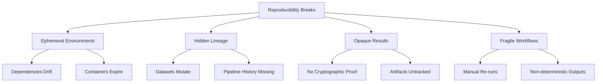
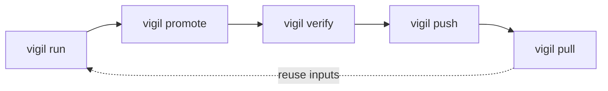
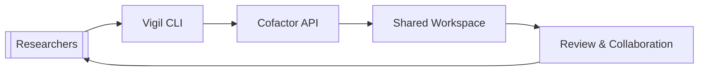
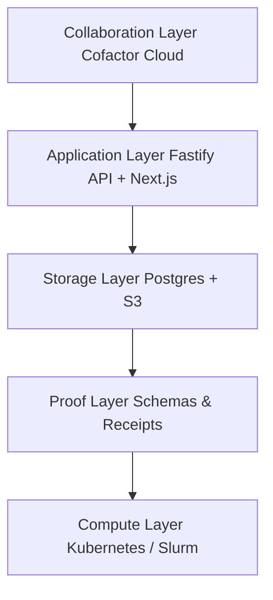
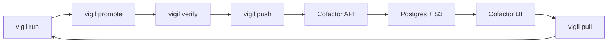

# Vigil & Cofactor: Verifiable Computational Science

Vigil creates cryptographically signed receipts for every computation. Cofactor turns those receipts into a shared research platform with verifiable provenance, collaboration, and long-term preservation. Together they make computational results reproducible, auditable, and easy to trust.

---

## Why Reproducibility Breaks

Most computational work still collapses under basic provenance checks: environments move on, datasets drift, and results arrive with no proof of origin.

Visual snapshot:



---

## Vigil in 60 Seconds

Vigil treats schemas as contracts and the resulting receipts as evidence. Every run captures:

- **Who** initiated it and under which project.
- **What** code, inputs, and parameters were used.
- **Where/when** it executed and in which environment.
- **How** outputs were produced and hashed.

Core CLI loop:

```
vigil run       → capture command, inputs, outputs
vigil promote   → canonicalize JSON + sign (Ed25519)
vigil verify    → deterministic validation of the receipt
vigil push      → upload to Cofactor
vigil pull      → rehydrate anywhere
```

Workflow at a glance:



Receipts travel offline, survive tooling changes, and can be re-verified decades later.

---

## Cofactor Platform

Cofactor operationalizes Vigil receipts into a shared research network.

- Unified workspace to browse, compare, and verify runs.
- API + SDK surface for automation and integrations.
- Storage backplane that keeps provenance synchronized with artifacts.
- Team permissions, collaborative reviews, and AI-assisted summaries.

Proof movement through Cofactor:



---

## Architecture at a Glance

The stack stays schema-driven end to end. JSON Schemas define every object, the API is generated from those schemas, and clients consume the same contracts.



---

## Proof Lifecycle

From first command to archived evidence:

| Stage | Tool | What happens |
| ----- | ---- | ------------- |
| **Run** | `vigil-core` | Capture command, inputs, outputs, environment |
| **Promote** | `vigil-core` | Canonicalize JSON (JCS) and sign (Ed25519) |
| **Verify** | `vigil-core` | Re-hash outputs and validate schema |
| **Push** | `vigil-client` | Upload via OpenAPI for secondary validation |
| **Persist** | `apps/api` | Store receipt + metadata in Postgres & S3 |
| **View** | `apps/app` | Surface proofs in the workspace UI |
| **Reproduce** | `vigil-client` | Pull receipts and artifacts anywhere |



---

## Integrity Guarantees

- **Canonical JSON (JCS):** deterministic bytes before hashing or signing.
- **SHA-256 digests:** stable identifiers for every artifact and receipt.
- **Ed25519 signatures:** tamper-evident authorship and integrity.
- **Schema validation:** prevents structural drift across services.
- **Transparency hooks:** optional Merkle anchoring for third-party attestations.
- **Local audit log:** `.vigil/audit.log` preserves every action.

---

## Roadmap

- Policy engine for institution-level reproducibility rules.
- Rich provenance graphs and dependency visualizations.
- Chunked artifact support for multi-terabyte datasets.
- Native SDKs in TypeScript, Go, and Rust.
- Collaborative, verified notebooks running on Cofactor Cloud.

---

## Try the Loop

```bash
vigil run python train_model.py
vigil promote
vigil push
```

Re-run `vigil pull` and `vigil verify` anywhere to prove the result.
