# 🧬 **Vigil × Cofactor — Verifiable Computational Science**

**Vigil** turns every computation into a cryptographically signed receipt.
**Cofactor** transforms those receipts into a shared research network where results carry permanent, verifiable provenance.
Together, they make computational work **reproducible, auditable, and effortlessly shareable** — the way GitHub did for code, Hugging Face did for models, and Benchling did for biology.

---

## ⚠️ Why Reproducibility Fails

Most computational results collapse under basic provenance checks.
Environments drift, datasets mutate, and “supplementary code” is rarely runnable months later.


The result: science without signatures — valuable but unverifiable.

---

## ⚙️ Vigil in 60 Seconds

Vigil treats **schemas as contracts** and **receipts as evidence**.
Every run captures exactly *who*, *what*, *where*, and *how* a computation occurred.

Core CLI loop:

```
vigil run       → capture command, inputs, outputs, env
vigil promote   → canonicalize JSON + sign (Ed25519)
vigil verify    → deterministic re-validation
vigil push      → upload to Cofactor
vigil pull      → re-hydrate anywhere
```


Receipts are portable JSON proofs — lightweight enough for GitHub, durable enough for archives.
They survive toolchains, can be re-verified decades later, and slot neatly into pipelines built with Cursor or Next.js-style automation.

---

## ☁️ Cofactor — The Research Network

Cofactor operationalizes Vigil’s receipts into a **GitHub-grade platform for scientific computation**.

* A shared workspace to **browse, compare, and verify** computational results.
* **APIs + SDKs** for automating provenance capture and validation.
* **Versioned storage** that keeps artifact hashes and metadata in sync.
* **Team collaboration** with reviews, permissions, and AI-assisted summaries (à la Cursor).


Think *Hugging Face × Benchling* for science:
models, data, and experiments all tied to verifiable receipts.

---

## 🧩 Architecture at a Glance

A fully schema-driven stack — like **Next.js** generating routes from code, Vigil generates APIs and SDKs from canonical schemas.

```mermaid
flowchart TD
  Collab[Collaboration Layer — Cofactor Cloud] --> App[Application Layer — Fastify API + Next.js UI]
  App --> Storage[Storage Layer — Postgres + S3]
  Storage --> Proof[Proof Layer — Schemas + Receipts]
  Proof --> Compute[Compute Layer — Kubernetes / Slurm / Local Core]
```



* **Schemas →** JSON Schema Draft 2020-12 define Projects, Runs, Artifacts, Receipts.
* **API →** Fastify + Prisma exposes those objects through an OpenAPI 3.1 contract.
* **Clients →** Python + TypeScript SDKs (generated) keep CLI and UI in lockstep.
* **Cofactor App →** Next.js 15 frontend renders the proof graph like GitHub renders commits.

---

## 🔄 Proof Lifecycle

| Stage         | Tool           | Action                              |
| ------------- | -------------- | ----------------------------------- |
| **Run**       | `vigil-core`   | Capture code, data, env             |
| **Promote**   | `vigil-core`   | Canonicalize + sign (JCS + Ed25519) |
| **Verify**    | `vigil-core`   | Re-hash and validate schema         |
| **Push**      | `vigil-client` | Upload via OpenAPI                  |
| **Persist**   | `Cofactor API` | Validate → store in Postgres/S3     |
| **View**      | `Cofactor App` | Explore proofs, lineage, metrics    |
| **Reproduce** | `vigil-client` | Pull receipts → re-execute locally  |


---

## 🛡️ Integrity Guarantees

* **Canonical JSON (JCS):** deterministic bytes before hashing.
* **SHA-256 digests:** immutable identifiers for artifacts and receipts.
* **Ed25519 signatures:** tamper-evident authorship and proof.
* **Schema validation:** prevents structural drift.
* **Transparency hooks:** optional Merkle anchoring for third-party attestations.
* **Local audit log:** `.vigil/audit.log` captures every action.

The same rigor that Git brings to commits, applied to computational evidence.

---

## 🗺️ Roadmap

* Institution-level **policy engine** for reproducibility enforcement.
* **Graph provenance** + interactive DAG visualizations.
* **Chunked artifact** support for multi-terabyte datasets.
* **Multi-language SDKs:** TypeScript, Go, Rust.
* **Collaborative notebooks** running on Cofactor Cloud.
* **AI assistants** (Cursor-style) for receipt introspection and proof generation.

---

## 🧪 Try the Loop

```bash
vigil run python train_model.py
vigil promote
vigil push
vigil pull
vigil verify
```

Re-run anywhere. Verify anytime.
**Vigil × Cofactor** makes computation as verifiable as commits —
a *GitHub for scientific truth* and a *Hugging Face for reproducible models.*
