# 🧬 **Vigil × Cofactor — Verifiable Computational Science**

**Vigil** turns every computation into a cryptographically signed receipt.
**Cofactor** turns those receipts into a shared scientific platform for provenance, collaboration, and long-term preservation.

Together, they make computational results **reproducible, auditable, and as easy to trust as a GitHub commit** — bringing the reliability of *GitHub* and *Next.js* to experiments, the collaboration of *Hugging Face* to models and datasets, and the traceability of *Benchling* to the lab of computational science.

---

## ⚠️ The Reproducibility Gap

Most computational results break under the simplest provenance test.
Environments drift, data mutates, and “supplementary code” is often unusable months later.


Science has GitHub for code, but not for *computations themselves*.

---

## ⚙️ Vigil in 60 Seconds

Vigil treats **schemas as contracts** and **receipts as evidence**.
Every `vigil run` captures who ran what, where, how, and with which data.

**The Vigil Loop:**

```
vigil run       → capture command, inputs, outputs, env
vigil promote   → canonicalize JSON + sign (Ed25519)
vigil verify    → deterministic validation
vigil push      → upload to Cofactor
vigil pull      → rehydrate anywhere
```


Each run generates a **receipt** — a portable, cryptographically verifiable JSON proof of computation that travels across machines, teams, and time.

Receipts are lightweight (a few KB), fully offline-verifiable, and remain valid decades after their creation.

---

## ☁️ Cofactor — The Research Network

Cofactor operationalizes Vigil into a shared workspace for scientific collaboration —
a *GitHub × Hugging Face × Benchling* for reproducible computation.

**Key Features:**

* Unified workspace to **browse, compare, and verify** experiments.
* **API + SDKs** for automation and integration.
* **Storage backplane** that synchronizes receipts, metadata, and artifacts.
* **Team permissions, collaborative reviews, AI-assisted summaries.**


> Cofactor is to scientific proof what GitHub is to code —
> an ecosystem for *verifiable computation* instead of just versioned text.

---

## 🧱 Architecture at a Glance

The stack is schema-driven end to end.
JSON Schemas define every object, OpenAPI exposes those objects, and clients consume the same contracts.

```mermaid
flowchart TD
  Collab[Collaboration Layer — Cofactor Cloud] --> App[Application Layer — Fastify API + Next.js UI]
  App --> Storage[Storage Layer — Postgres + S3]
  Storage --> Proof[Proof Layer — Vigil Receipts + JSON Schemas]
  Proof --> Compute[Compute Layer — Kubernetes / Slurm / Local Vigil Core]
```



| Layer                   | Component                        | Description                               |
| ----------------------- | -------------------------------- | ----------------------------------------- |
| **Proof Layer**         | *Vigil Core*                     | Cryptographic receipts, schema validation |
| **Storage Layer**       | *Postgres + S3*                  | Metadata and artifact persistence         |
| **Application Layer**   | *Fastify API + Prisma + Next.js* | REST + Web App                            |
| **Collaboration Layer** | *Cofactor Cloud*                 | Workspaces, sharing, reviews, policies    |
| **Compute Layer**       | *Local + Cloud Runtimes*         | Deterministic execution environments      |

---

## 🔁 Proof Lifecycle

| Stage         | Tool           | Action                                        |
| ------------- | -------------- | --------------------------------------------- |
| **Run**       | `vigil-core`   | Capture command, inputs, outputs, environment |
| **Promote**   | `vigil-core`   | Canonicalize JSON (JCS) and sign (Ed25519)    |
| **Verify**    | `vigil-core`   | Re-hash outputs and validate schema           |
| **Push**      | `vigil-client` | Upload via OpenAPI to Cofactor API            |
| **Persist**   | `apps/api`     | Validate → store in Postgres + S3             |
| **View**      | `apps/app`     | Browse receipts, datasets, and provenance     |
| **Reproduce** | `vigil-client` | Pull receipts and rerun anywhere              |


---

## 🧩 The Starter Vigil Repository

Every Vigil project starts like a GitHub repo — except it’s designed for verifiable computation, not just version control.

**Directory structure:**

```
my-vigil-project/
├── code/
│   ├── train.py              # Your computation
│   └── evaluate.py
├── data/
│   ├── handles/
│   │   └── dataset_v1.dhandle.json
│   └── raw/
│       └── dataset.csv
├── results/
│   └── model_v1.pt
├── notes/
│   └── 2025-10-22-first-run.md
├── policies/
│   └── reproducibility.json
├── environment.yml
├── vigil.yaml                # Project manifest
└── .vigil/
    ├── receipts/
    ├── cache/
    ├── registry.db
    ├── keys/
    └── audit.log
```

**vigil.yaml (project manifest):**

```yaml
project:
  name: my-vigil-project
  description: Example reproducible experiment
  organization: science-abundance
  visibility: internal

storage:
  datasets: s3://science-projects
  artifacts: s3://science-artifacts
```

### The Local Proof Loop

```bash
vigil init
vigil run python code/train.py
vigil promote
vigil verify
```

### Push to Cofactor

```bash
vigil login
vigil push
```

View it instantly at:

```
https://cofactor.science/@yourname/my-vigil-project
```

---

## 🛡️ Integrity Guarantees

* **Canonical JSON (JCS):** deterministic bytes before signing.
* **SHA-256 digests:** stable, content-addressed identifiers.
* **Ed25519 signatures:** tamper-evident authorship.
* **Schema validation:** enforces structural integrity system-wide.
* **Transparency hooks:** optional Merkle anchoring for timestamping.
* **Audit logs:** `.vigil/audit.log` preserves every local action.

As GitHub commit hashes prove code history, Vigil receipts prove *computational history*.

---

## 🧭 Roadmap

| Focus                | Upcoming Capabilities                                           |
| -------------------- | --------------------------------------------------------------- |
| **Governance**       | Institution-level policy engine for reproducibility enforcement |
| **Visualization**    | Rich provenance graphs and dependency DAGs                      |
| **Storage**          | Chunked artifact support for multi-terabyte data                |
| **Interoperability** | Native SDKs in TypeScript, Go, Rust                             |
| **AI Integration**   | Verified notebooks + AI agents that can explain receipts        |
| **Automation**       | Cursor-style proof introspection and autofix suggestions        |

---

## 🧪 Try the Loop Yourself

```bash
pip install vigil-science
vigil init
vigil run python train_model.py
vigil promote
vigil push
vigil pull
vigil verify
```

Every command leaves behind a cryptographically verifiable record —
a **receipt** for science.

---

### Vigil × Cofactor

**The GitHub of Computational Proof.**
As Hugging Face became the registry for models,
and Next.js unified the web,
**Vigil and Cofactor make reproducible science the default.**

> *Science, finally, with a receipt.*
